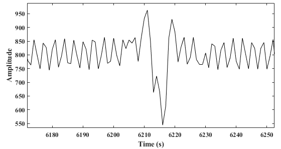
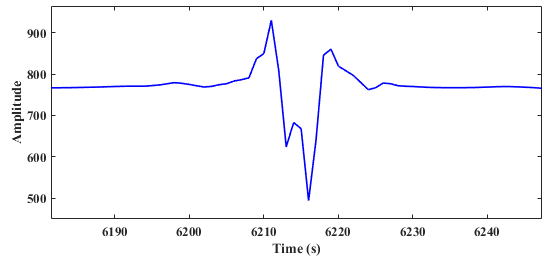
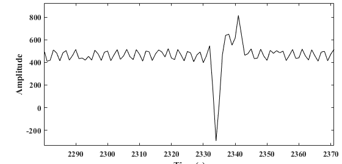
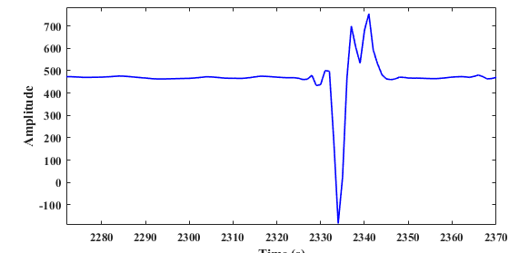
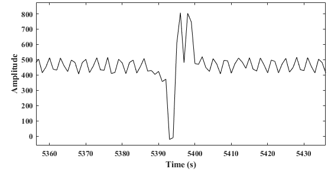
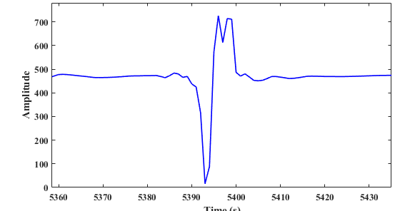

# Vehicle Speed Estimation Based on Adaptive Multi-Layer Decomposition Denoising of Magnetic Signals

This repository provides the implementation and dataset for our AMLD-based vehicle speed estimation method.

AMLD is designed for vehicle speed estimation using roadside magnetic sensor networks under electromagnetic interference. It follows a three-stage pipeline:

**Signal Denoising → Vehicle Re-identification → Speed Estimation**

The upstream and downstream magnetic signals are first processed using an adaptive multi-layer decomposition method to suppress interference and extract vehicle-related signal components. Vehicle-active intervals are subsequently matched across sensor nodes using an **energy-weighted IMF-DTW** strategy for vehicle re-identification. Based on the matched vehicle passages, the vehicle speed is calculated using the sensor spacing and the corresponding inter-node time delay.
## File Structure

IMFs (Intrinsic Mode Functions) are the signal components produced by decomposition.

| File | Description |
|---|---|
| `main.m` | Runs batch processing on TXT files and applies Parts 1–6 to sensors. |
| `part1_sliding_entropy_analysis.m` | Identify vehicle segments and ultimately output segment boundaries for use in subsequent analysis. |
| `part2_vmd_decomposition.m` | Decomposes the input signal using VMD by default, sorts modes from low to high frequency, and saves decomposition results. |
| `part3_correlation_analysis.m` | Uses global correlation and vehicle–background correlation differences to classify modes as signal, noise, or mixed components, returning the IMF indices used for reconstruction and refinement. |
| `part4_signal_reconstruction.m` | Reconstructs the signal by summing selected signal and mixed IMFs. |
| `part5_similarity_evaluation.m` | Compares the original reconstruction with linear calibration and several offset corrections, selecting the variant with the highest estimated SNR. |
| `part6_adaptive_redecomposition.m` | Refines mixed IMFs through repeated VMD decomposition, submode selection, and reconstruction for up to five iterations. |
| `part7_denoised_window_features.m` | Detects vehicle intervals in two denoised sensor signals using window energy and variance. Compares sequentially paired vehicle segments using Dynamic Time Warping (DTW), reports an adaptive-threshold matching percentage as ReID-ACC, and estimates speed from the first detected arrival-time difference using an 9 m sensor spacing. |
| 'dataset' | The dataset is located in this folder. |
| 'figure' | The images showing examples are in this folder. |
 
### Current Entry-Point Behavior

- The active batch workflow runs Parts 1–6. The two-sensor workflow that calls Part 7 is currently commented out.
- Input TXT files must contain at least four columns. The batch workflow reads time from column 1 and the first sensor signal from column 3.
- Data and clean-reference paths are currently hard-coded and should be updated before running.
- Part 5 uses clean references for evaluation and calibration. Part 6 uses blind SNR for refinement and does not recompute reference-based correlation after each update.


## Environment

- **MATLAB** — use a version compatible with the project scripts.
- Add all project scripts and required helper functions to the MATLAB path.
- Ensure that the VMD implementation and any toolboxes called by the scripts are available.

*The required MATLAB version and toolbox list should be confirmed from the source code.*

## Dataset

The dataset is organized by noise type: `cable`, `gaussian`, `impulse`, and `subway`. Each category contains sample folders with the following structure:

```text
datasets/
├── cable/
│   ├── sample1/
│   │   ├── label.txt
│   │   ├── sensor1.txt
│   │   └── sensor2.txt
│   ├── sample2/
│   ├── sample3/
│   ├── sample4/
│   └── sample5/
├── gaussian/
│   └── ...
├── impulse/
│   └── ...
└── subway/
    └── ...
```

Each sample folder contains:

- `label.txt`: sample speed information.
- `sensor1.txt`: signal data from sensor 1.
- `sensor2.txt`: signal data from sensor 2.

All noise categories follow the same sample folder structure. Update the dataset path in the MATLAB scripts before running.


## Usage

1. Open the project directory in MATLAB.
2. Add the required scripts and helper functions to the MATLAB path.
3. Prepare the dataset and update the data paths and processing parameters in the code.
4. Run:

```matlab
main
```

## Denoising Results

The proposed AMLD method effectively suppresses interference while preserving the main vehicle-related magnetic response. Three representative examples of magnetic signals before and after denoising are presented below.

### Example 1

**Before denoising**

<p align="center">
  
</p>

**After denoising**

<p align="center">
  
</p>

### Example 2

**Before denoising**

<p align="center">
  
</p>

**After denoising**

<p align="center">
  
</p>

### Example 3

**Before denoising**

<p align="center">
  
</p>

**After denoising**

<p align="center">
  
</p>

As shown in the three examples, the original magnetic signals contain noticeable interference components that may obscure vehicle-induced magnetic variations. After applying the proposed multi-layer decomposition-based denoising method, the interference components are effectively suppressed while the main waveform characteristics associated with passing vehicles are preserved. The resulting cleaner magnetic signatures provide a more reliable basis for subsequent cross-node vehicle re-identification and speed estimation.

